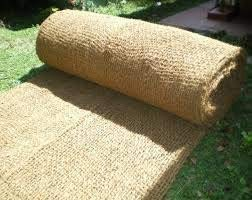

#### production Plate

## Requried materials
#### 1. juite



    GSM (Gram / Sq meter) : 150-175 gsm
    Fabric type : Greige
    Weave type : Plain
    
## 2. Resin (pf Resin)

#### viscosity 
    40-45
#### hydrometer No :
     20-22

#### colour : 
nabi colour ```quatity= 2.5kg per 100kg resin & mix it with 2 lit methonal ```

#### KAE chemical 
     200g per 100kg

#### R/C 
    Sample = 50-55%
    normal = 45-48%


## steam temp

#### Blower temp
    tem1 = 110 -120 c
    tem2 = 120 -130 c
    tem3 = 130 -145 c
    cooling air 

#### speed of Rollers
    5-6 rmp

